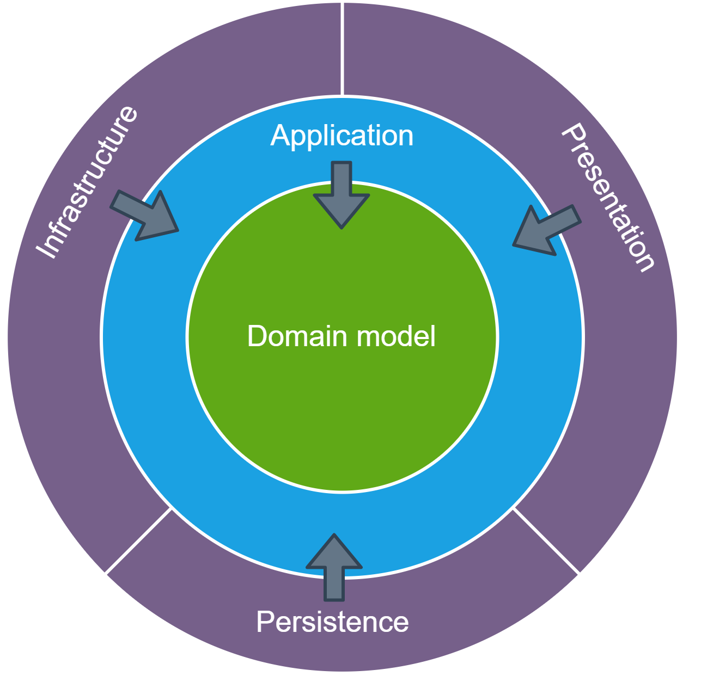

# Clean Architecture/Clean Code

Clean Architecture et Clean Code sont deux mouvements (l'un - clean code - précédent l'autre) démarrés par des gens comme Robert Martin. Ils reprennent différentes réflexions à propos de différentes situations qu'on peut rencontrer en développant du code informatique, notamment quand on considère le code monolithique.

Suite à ces réflexions, un certain nombre de bonnes pratiques ont été définies afin de rendre le code plus lisible et l'architecture plus apte à la transformation et à l'adaptation.

## Clean code

Pour résumer en une phrase : le clean code c'est valoriser l'intention avant tout.

Un code dont l'intention est claire sera :
- facile à lire (or on passe beaucoup plus de temps à lire du code qu'à en produire)
- facile à maintenir (puisque facile à comprendre)
- facile à tester (pas certain mais généralement un code clean a aussi pour intention d'être testable)
- facile à débugguer (puisque généralement il est fait de petits bouts de code assez indépendants et donc un bug sera plus facile à trouver)
- plus efficace en termes de maintien de la dette technique.

On estime qu'un code dont la strcuture est cohérente sera aussi plus fonctionnel. En gros, là où les développeurs sont contents, les utilisateurs le sont aussi.

PS : ceci n'est pas forcément vrai dans certaines conditions avec des contraintes fortes (code embarqué, gaming, ML).

Quelques exemples de clean code :

```swift
let isNotClean = true
//not clean code
if !isNotClean {
    print("I am clean")
}
//clean code
let isClean = !isNotClean
if isClean {
    print("I am clean")
}
```

ou encore

```swift
struct Journey {
    let time: Float
    let averageSpeed: Float
}
struct Car {
    let costPerKilometre: Float
}
```

```swift
//not clean code
func calculateFuelCost( journey: Journey, car: Car) -> Float {
  let journeyTime = journey.time;
  let averageSpeed = journey.averageSpeed;
  let distance = calculateDistanceTravelled(journeyTime, averageSpeed)
  return car.costPerKilometre * distance
}

func calculateDistanceTravelled(_ journeyTime: Float,  _ averageSpeed: Float) -> Float {
  journeyTime * averageSpeed;
}
```

```swift
//clean code
func calculateFuelCost( journey: Journey, car: Car) -> Float {
    car.costPerKilometre * journey.distanceTravelled
}

extension Journey {
    var distanceTravelled: Float {
        time * averageSpeed
    }
}
```

Le clean code est aussi (et presque avant tout) un standard d'équipe, il dépend donc de votre équipe, de sa maturité, de sa cohésion, de ses envies.

Tout dépend où (dans quel code) vous souhaitez travailler :
 vs 

## Clean Architecture

La clean architecture se réclame du clean code. Elle part de principes simples, notamment du fait que certaines décisions devraient prises le plus tard possible. La structure de votre application devrait permettre de repousser certains choix, voire même de ne jamais les prendre, comme par exemple, le choix d'une Database, ou le choix d'une UI.

Votre architecture devrait aussi être souple au changement et vous permettre de débrancher des composants quand vous le souhaitez, par soucis de réactivité mais aussi (et surtout) de testabilité.

On parle souvent d'architecture en pelure d'onion, où chaque pelure est traversée dans un seul sens et où plus l'on va vers le centre plus l'on touche au coeur du métier (à la logique business).

Nous verrons des exemples concrets (ou des contre-exemples) plus tard.

