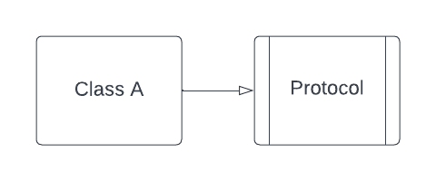

# UML

Le but n'est pas de faire une présentation complète de UML (Unified Modeling Language), mais juste de rappeler qu'on peut représenter une architecture (la modéliser) en utilisant des schémas ce qui permet de la "voir" plus facilement et aussi de l'analyser et la comprendre.

UML est un des langages de représentation pour l'architecture. Il est très complexe et or de portée de cette formation, cependant j'en retiens deux principes (oui, 2 principes sur un outil aussi vatse et intéressant c'est se moquer du monde...) :
- le principe de dépendance
- le principe d'interface


## Dépendance

On dit qu'une classe A dépend d'une classe B quand elle utilise la classe B de manière explicite ou par "rebond". Une classe peut dépendre d'une interface, d'une autre classe, d'un struct, d'une librairie...

Exemple :

```swift
struct B {
    let name: String
}

class A {
    let b: B
    init(b: B) {
        self.b = b
    }

    func test() {
        print(b.name)
    }
}
```

Ici, A dépend de B. Une dépendance crée un lien fort. Tout changement de B aura des conséquences probables sur A.

Exemple de "rebond" :

```swift
struct B {
    let name: String
    let c: C
}

struct C {
    let family: String
}

class A {
    let b: B
    init(b: B) {
        self.b = b
    }

    func test() {
        print(b.name)
    }
}
```

A dépend aussi de C, puisque B dépend de C.

On note une dépendance en UML avec une flèche pleine dans le sens de la dépendance.

Exemple :


## Interface

Une interface (un protocol en iOS) est un contrat. Une classe (ou un struct, ou une autre interface, ou un autre truc) peut implémenter une interface. Dans ce cas elle doit répondre à toutes les contraintes du contrat.

Exemple :

```swift
protocol Employeur {
    var salaire: Int { get }
    func prime(anciennete: Int) -> Int
}

class Entreprise {}

extension Entreprise: Employeur {
    var salaire: Int {
        10000
    }

    func prime(anciennete: Int) -> Int {
        salaire * anciennete
    }
}
```

On note le fait d'implémenter une interface par une flèche vide de la classe vers l'interface.

Exemple :



## Inversion de dépendance

On confond souvent Inversion de dépendance avec Injection de dépendance. La seconde est permise par l'application de la première.

Exemple :

Une classe A dépend d'une classe B.


On dit qu'on inverse la dépendance de A à B lorsque l'on crée une interface entre A et B et que A va dépendre de cette interface et que B va implémenter cette interface.


On voit bien que la flèche qui part de B a changé de sens. Maintenant c'est A qui définit son contrat et B qui doit le respecter. Si B change, le contrat est cassé mais A ne casse plus.

On voit alors toute l'importance d'une interface (d'un protocol) et son utilité pour mettre en place des architectures souples et ne traversant les couches que dans un sens.

## Exercice

Ouvrir le [Playground UML](playgrounds/UML.playground)

1. Etablir un diagramme UML pour les exemples 1 et 2
2. Dans l'exemple 1 comment inverser la dépendance de A à B, de A à C, de B à C
3. Etablir un diagramme de l'exemple 3. Que remarque-t-on ? Comment le corriger ?
4. Etablir un diagramme de l'exemple 4. Que remarque-t-on ? Comment le corriger ?
