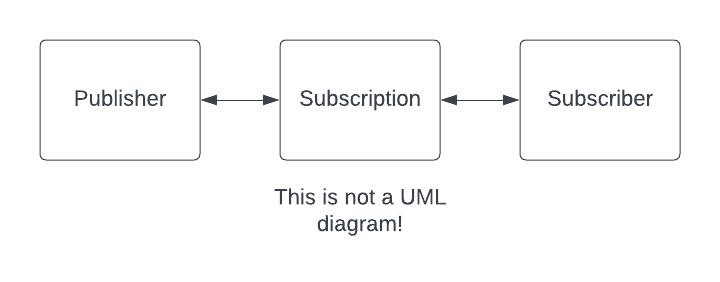

# Protocol Oriented

Swift est langage formtement orienté protocol. Ca signifie que les protocols sont des types primitifs (on peut travailler avec comme avec des classes ou des structs, ou des enums) et que les protocols peuvent réaliser quasiment tout ce que font les autres types primitifs.

L'avantage de cette approche est qu'elle permet un découplage fort de tout ou partie du code.

## Exemple

Prenons le cas d'un programme de gestion de voitures essence et électrique. En orienté objet classique, on utiliserait la notion d'héritage comme suit :

```swift
// Old School Inheritance

class Car {
    var color: Int
    var price: Int
    init(color: Int, price: Int) {
        self.color = color
        self.price = price
    }

    func switchOn() {}
}

class ElectricCar: Car {
    func charge() {}
}

class GasCar: Car {
    func refill() {}
}
```

Les problèmes de cette approche sont assez nombreux, mais parmi d'autres, on notera :
- risques de violation de SRP (la classe Car risque de faire trop de choses)
- risque de régression quand on touche à la classe Car (violation de OCP)
- impossible d'utiliser des structs (pas d'héritage avec les structs...)
- risque de violation de LSP avec utilisation de l'override
- difficulté d'étendre les fonctionnalités et manque de souplesse
- pas de multi-héritages en Swift !

Avec une approche orientée protocols (approche par **composition**) on ferait comme suit :

```swift
// Protocol Oriented approach

protocol Car {
    var color: Int { get }
    var price: Int { get }
    init(color: Int, price: Int)
    func switchOn()
}

protocol Electric {
    func charge()
}

protocol Gas {
    func refill()
}
```

Avec cette approche, on peut complètement découpler la notion de Car de celle d'Electric ou de Gas. Une voiture pourrait même implémenter les 3 protocols (pas besoin de créer une sous-classe hybride...).

En outre, avec la notion d'implémentation par défaut on peut factoriser aisément du code sans devoir le copier dans chaque implémentation (ce qu'on reproche souvent à l'approche par "composition").

On peut utiliser des structs et des enums qui peuvent implémenter plusieurs protocols.

On peut procéder par extension (et donc respecter OCP plus facilement).

On peut découper les protocols en petits protocols plus légers et faciles à implémenter et à comprendre (respect de ISP).

On peut masquer l'implémentation et ne présenter qu'un contrat et donc fournir des mocks (voir la partie Tests Unitaires).

Quelques articles importants sur ce sujet :
- [Tenserflow: Protocol-oriented programming & generics](https://www.tensorflow.org/swift/tutorials/protocol_oriented_generics?hl=en)
- [Adopting Common Protocols](https://developer.apple.com/documentation/swift/adopting-common-protocols)
- [Swift: Protocols](https://docs.swift.org/swift-book/documentation/the-swift-programming-language/protocols)

## Examen d'une librairie Apple orientée protocol : Combine

[Combine](https://developer.apple.com/documentation/combine) est une librairie Apple basée sur le Reactive Functional Programming. Elle est entièrement définie à l'aide de protocols. Examinons comment elle fonctionne.

### Le principe rapidement

En Combine, des Subscribers écoutent des évènements produits par des Publishers.



Afin de rendre toute l'implémentation souple, les 3 éléments principaux (Subscriber, Publisher, Subscription) ont tous été définis sous la forme de protocols.

```Swift
public protocol Subscriber<Input, Failure> : CustomCombineIdentifierConvertible {
    associatedtype Input
    associatedtype Failure : Error
    func receive(subscription: Subscription)
    func receive(_ input: Self.Input) -> Subscribers.Demand
    func receive(completion: Subscribers.Completion<Self.Failure>)
}
```

```Swift
public protocol Publisher<Output, Failure> {
    associatedtype Output
    associatedtype Failure : Error
    func receive<S>(subscriber: S) where S : Subscriber, Self.Failure == S.Failure, Self.Output == S.Input
}
```

```Swift
public protocol Subscription : Cancellable, CustomCombineIdentifierConvertible {
    func request(_ demand: Subscribers.Demand)
}
```

Exercice :

Ouvrir le [Playground Combine](playgrounds/Combine.playground)

1. A votre avis, ça fait quoi ce truc ?
1. Etablir un diagramme "UML" rapide
1. Etablir un diagramme de "flow"
1. Pourquoi DecodableDataTaskSubscriber dispose-t-il d'une méthode cancel ?
1. Réécrire DecodableDataTaskSubscriber en utilisant des extensions ?