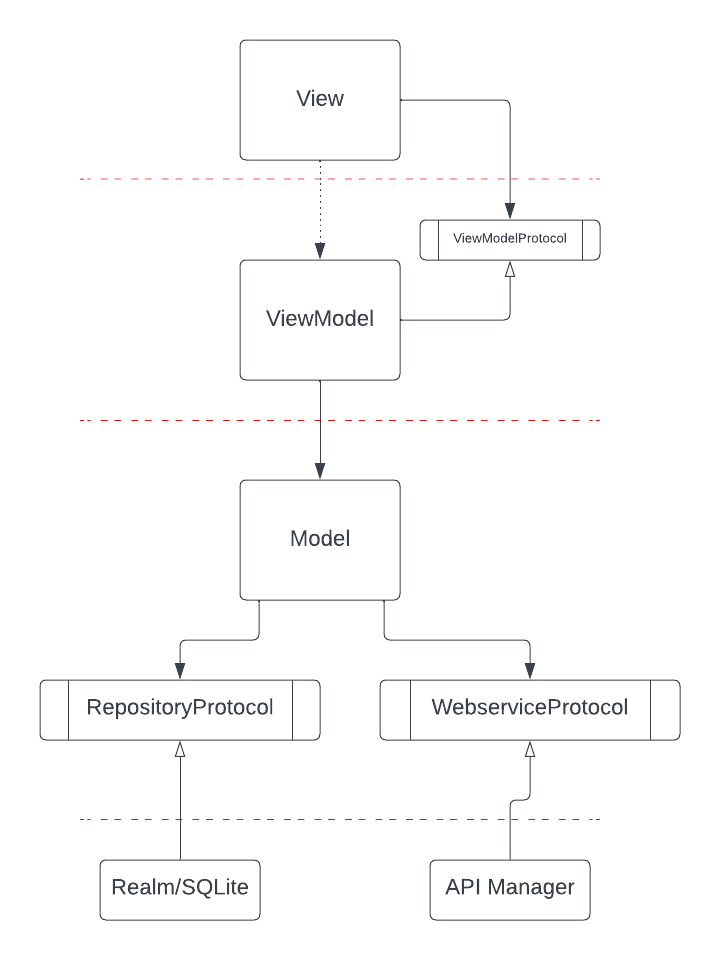

# Exemples d'architecture

Apple (et Swift) ne force pas une architecture spécifique comme c'est le cas dans d'autres langages. Les développeureuses peuvent donc choisir comment architecturer leur code comme bon leur semble.

Il n'existe pas de bonne ou de mauvaise architecture, mais il existe assurément de bonnes et de mauvaises pratiques.

En premier lieu, la pire pratique est : **mettre en place une architecture que vous ne maitrisez pas**. Vous pouvez choisir l'architecture la plus clean, évoluée, à la mode possible, si vous ne la maitrisez pas elle sera catastrophique.

Une architecture est donc un **travail commun, d'équipe** et doit être acceptée par toustes, surtout les "moins" séniors.es.

En second lieu, vous devez définir ce qui vous semble le plus à même de bouger et vous en découpler au maximum. Si vous pensez que votre DB va beaucoup changer, cachez la derrière un protocol, si vous pensez que votre UI est un gros facteur de modification, évitez d'avoir des dépendances dessus (n'y cachez pas des variables ou des singletons, ou de l'état).

Une fois ce premier "travail" éffectué, commencez à considérer des architectures classiques.

je ne vais pas détailler toutes les architectures (je ne les connais d'ailleurs pas toutes...), mais en évoquer quelques-unes qui sont d'ailleurs très proches l'une de l'autre : MVVM, MVC, MVP et potentiellement VIPER.

## MVVM

MVVM vaut pour Model, View, ViewModel.

Le Model contient en général votre logique profonde (logique Business), le ViewModel contient votre logique d'affichage et sert aussi de communication entre la View et le Model. La View enfin, contient... la view (la vue), les éléments graphiques.

la View est censée être stupide : elle transmet les interactions avec l'utilisateur et retourne des affichages. Elle ne communique qu'avec le ViewModel (dont elle dépend souvent fortement - quoiqu'avec SwiftUI on peut cacher ce ViewModel derrière un protocol pour faire de la preview dans XCode ce qui permet de gagner beaucoup de temps de dev). En tout état de cause, **personne ne doit dépendre de votre View**, surtout pas votre ViewModel et encore moins votre Model.

Le ViewModel peut aussi dépendre de votre Model, mais votre Model devrait être totalement indépendant.

Dans ce diagramme, on constate que les **lignes pointillées rouges ne sont franchies que dans un seul sens**.

## MVP et MVC

MVP et MVC sont deux autres architectures très proches de MVVM. Le M vaut toujours pour Model et le V pour View, mais ici, le C vaut pour Controller et le P pour Présenter.

Le MVC était fortement utilisé avec la librairie UIKit qui intégrait la notion de ViewController. On avait alors tendance à considérer cet élément comme un condensé des deux (ce qui cassait l'architecture en rendant le COntroller et sa View totalement dépendants). On obtenait alors régulièrement des massive ViewController (sorte de bout de code tentaculaire avec une vie propre et une évolution souvent catastrophique...).

Le MVP était plus présent du côté Androïd.

## A propos du Model

Dans certaines représentations du MVC, et spécialement dans les représentations venant de francophones, le Model est associé au modèle de données (il arrive même que le Model discute avec la View directement et de manière bilatéral, mais là c'est plus un problème de compréhension globale du MVC que de traduction). Certes, le Model récupère souvent des datas (des "objets") d'autres couches externes (comme une DB ou un webservice par exemple), cependant, ces datas sont souvent confondues avec la notion de modèle de données et donc avec le Model. Le Model n'est pas ces datas, le Model va transformer, analyser, utiliser, vérifier, compacter, gérer ces datas pour en faire quelque chose d'utilisable par le Controller ou le View Model. Dire que le Model est un modèle de données est une erreur de traduction, on devrait traduire Model plutôt comme une Maquette ou une Moulinette à inputs.

**Le Model est la Moulinette qui va transformer les datas en petits bouts de datas facilement utilisable par le ViewModel (la Moulinette pour la View)**. C'est à ce titre que le Model contient votre logique Business.

**Le Model n'est pas un modèle de données.**

Exemple :

Je dois afficher un résumé des comptes bancaires de l'utilisateur :
- le Model récupère tous les comptes, filtre les comptes de type bancaires, vérifie les informations pour chaque compte, trie les comptes et effectue des regroupements, renvoie un tableau avec des objets comptes correctement formatés et cohérents pour le ViewModel.
- le ViewModel transforme la liste de comptes en un tableau contenant id, numéro de compte au format Iban, solde, couleur du solde. Si le solde est négatif, la couleur du solde sera rouge. Le formattage Iban est pris dans le ViewModel.
- la View affiche une liste déroulante sous forme de cellules.

Seules les parties ViewModel et Model sont testées unitairement. On privilégie des fonctions pures. Le Model récupère ses informations depuis un protocol injecté à l'init.

### Exercice

établir un schéma UML précis et tenter une implémentation en pseudo-code.

## VIPER

VIPER a été une très belle architecture sur le papier puisqu'elle permettait un découplage comme le MVVM mais avec la notion d'Interactor qui permattait de mettre en place des navigations complexes.

La navigation entre vues est souvent un gros problème en iOS (et il n'y a pas de belle solution pour le résoudre). La navigation va surtout soulever le problème de l'état (que nous verrons un peu plus tard), plus précisément : où se trouve la vérité dans votre app ?

Certains.es répondront dans l'affichage (ce que voit l'utilisateur est la vérité - et légalement c'est parfois le cas), d'autres diront le backend (mais alors on affiche quoi en mode déconnecté), d'autres diront dans la database synchronisée entre le device et le backend (mais quel timestamp fait foi ?). C'est une question qu'il faut trancher avec le business et le dev.

## Exercice

Prenez une app sur ce repo et tentez de définir son "architecture" : 

[Example iOS Apps](https://github.com/jogendra/example-ios-apps)

Vous allez voir, c'est très drôle... et aussi très dur, voire parfois impossible !