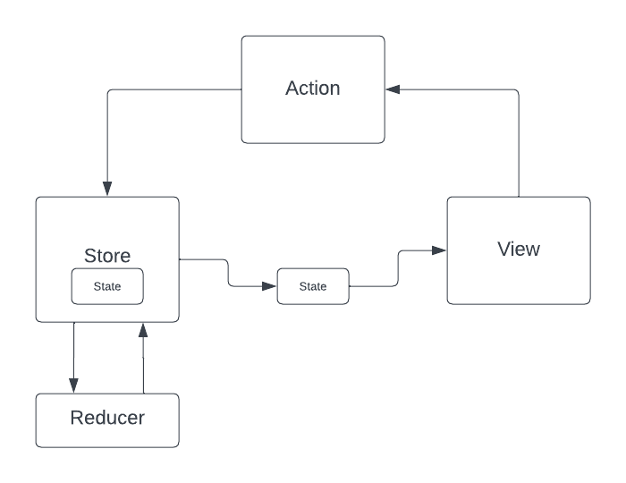

# Side Effect/State management

## Side Effect

en programmation, on dit qu'une fonction, un élément, un truc, a un **"side effect"** si ce truc modifie quelque chose en dehors de son environnement personnel.

Exemple :

```swift
var greeting = "Hello, playground"

func IHaveASideEffect(_ value: String) {
    greeting = value
}

print(greeting) // Hello, playground
IHaveASideEffect("Hello Fred")
print(greeting) // Hello Fred
```

On voit bien que la méthode `IHaveASideEffect` a modifié une variable en dehors de son contexte. Elle a modoifié l'état (le state) de l'application.

Le problème de ce type de truc est qu'ils génèrent des tonnes de bugs et sont extrèmement difficile à tester.

On constate aussi un autre problème dans notre exemple :

La méthode `IHaveASideEffect` n'est pas une fonction pure. Outre qu'elle a modifié un état en dehors de son périmètre, elle ne retourne rien, on ne peut donc pas prévoir ce qu'elle fait sans la lire.

*Définition* : une fonction pure est une fonction qui renvoie toujours la même chose en fonction de paramètres d'entrée donnés.

**Règle** : Les méthodes qui ne renvoit rien (qui ne sont pas pures) devraient être considérées comme un code smell, au même titre que la compléxité cyclomatique. 

Une méthode qui ne renvoie rien, en général, modifie de l'état ou change quelque chose à l'extérieur d'elle-même (si ce n'est pas le cas alors en général c'est qu'elle ne sert à rien...).

***Corollaire*** : On devrait toujours privilégier des fonctions pures.

Voir : [side effect](https://en.wikipedia.org/wiki/Side_effect_(computer_science))

## State Management

La notion d'état n'est pas tout à fait claire et dépend largement des dévelopeureuses qui en parlent. Pour certains.es, il s'agit de la couche de persistence, pour d'autres de la manière dont le flux de données circulent dans l'app. L'état est aussi dépendant de votre business, il sera différent pour une banque, pour un site de vente en lignes, pour une messagerie.

### Exercice

définissez ce que représente l'état pour vous ?


## Redux 

La notion de state management se réfère à la façon de gérer cet état au cours de l'utilisation de votre applicatif. Il existe de nombreuses méthodes pour gérer cet état, que nous ne couvrirons pas ici, sauf une : Redux.



L'intérêt de Redux réside en deux points :
- les reducers sont des fonctions pures
- le state n'est qu'à un seul endroit et la View ne récupère que des copies immutables de ce state

Les fonctions pures sont facilement testables, le fait que le state soit immutable (hormis par le Store qui utilise les Reducers) empêche les modifications involontaires et évite les concurrents access...

Je ne dis pas qu'on devrait faire du Redux en Swift. Cependant, je trouve que c'est une belle source d'inspiration qu'on peut par ailleurs utiliser en utilisant au maximum les structs, les fonctions pures et en rendant nos composants stateless au maximum.


Liens :
- [Reswift](https://github.com/ReSwift/ReSwift#about-reswift)
- https://quickbirdstudios.com/blog/swiftui-architecture-redux-mvvm/
- https://redux.js.org/

## Imperative programming vs functional programming (and Reactive Functional Programming...)

### imperative programming
- décrit **comment** on résoud un problème pas à pas (**how**)
- changement/mutation d'état
- assignations directes
- accès concurrent (non thread safe)
- compliqué à unit tester
- souvent relié à l'utilisation de `class` (mutable, référence)
- meilleure performance

```swift
import Foundation

/*
 dans le tableau suivant je veux remplacer toutes les occurences de "***" par "Pierre", retirer tous les termes qui contiennent "js", puis former une phrase avec des espaces entre les mots, un point à la fin et une majuscule
 */

let mots = ["je", "constate", "que", "***", "est", "une", "buse", "en", "js", "programmation"]

extension String {
    func capitalizingFirstLetter() -> String {
        return prefix(1).capitalized + dropFirst()
    }
}
```

```swift
//imperative
var phrase = ""
for mot in mots {
    if mot.contains("js") {
        continue
    }
    var newMot = mot
    if mot == "***" {
        newMot = "Pierre"
    }
    phrase += newMot + " "
}
phrase = String(phrase.dropLast())
phrase = phrase.capitalizingFirstLetter()
phrase = phrase + "."
print(phrase)
```

### functional programming
- décrit **ce** qu'on va faire (approche procédurale) (**what**)
- pas (*ou peu*) de changement d'état
- fonctions pures
- plus facile à unit tester
- souvent relié à l'utilisation de `struct`(immutable, copy)
- moins bonne performance (le hardware actuel n'est pas optimisé pour le functional)
- thread safe

```swift
//functional
let phraseFunc = mots
    .filter{ !$0.contains("js")}
    .map{ $0 == "***" ? "Pierre" : $0}
    .joined(separator: " ")
    .capitalizingFirstLetter()
    .appending(".")
print(phraseFunc)
```

### functional reactive programming
mélange entre le reactive programming, programmation basée sur la réaction à des évènements et le functional programming.
Le functional programming dans ce cadre permet d'utiliser des fonctions pures et l'immutabilité pour éviter les problème d'accès concurrents liés aux changements d'état et au multi threading.


